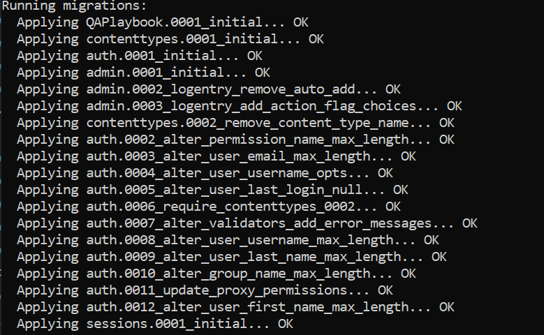
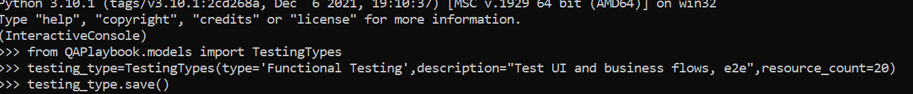
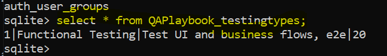
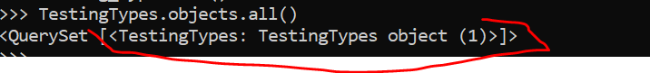
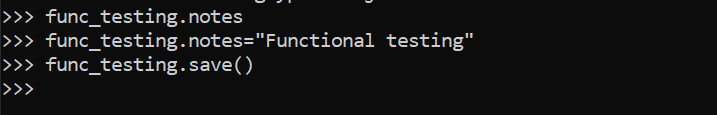
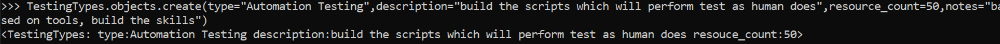

## Poetry
task:activate virtual environment -- `source $(poetry env info --path)/bin/activate`
or
`..\-101-r0O1BFpF-py3.10\Scripts\activate.bat`

## django
- run server `python manage.py runserver`
- 

## Admin
- create login(http://127.0.0.1:8000/admin) credential `python manage.py createsuperuser`
    - if getting error `no such table: auth_user` then execute  `python manage.py migrate` and then run create superuser.

## setting up database and Models
- QAPlaybook/models - add class TestingTypes
- register the model - i.e. add the app to `INSTALLED_APPS`
- migration is steps for django to work with database. after model, create migration and run migration. so run command `python manage.py makemigrations`, creates files in migration folder.
- to create table or so, run `python manage.py migrate` , will create the project models plus all the models part of installed app like admin.
 

- Debug tip - download sqlite3 CLI. type `.tables` will show the `QAPlaybook_testingtypes` in list of tables
- Insert into table - go to shell `python manage.py shell` and create a class object
    `from QAPlaybook.models import TestingTypes` and then save(writes to DB)
    
    
- to get all the list, can run `TestingTypes.objects.all()`

- update existing entry:

- delete `object.delete()`
- `create` to create multiple entries
    
- Queries - get -> ` TestingTypes.objects.get(id=1)` or filter ` TestingTypes.objects.filter(id=1)` or to get >=1 `TestingTypes.objects.filter(id__gte = 1)`

- If data model need to be mange at admin `QAPlaybook\admin.py`